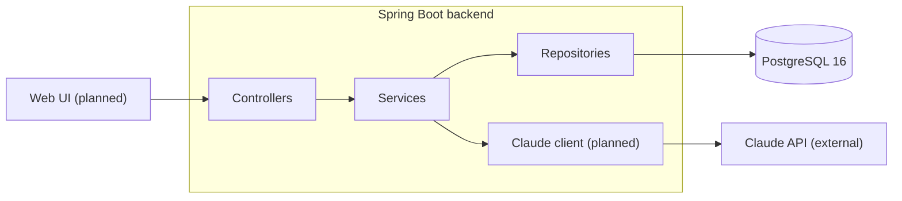
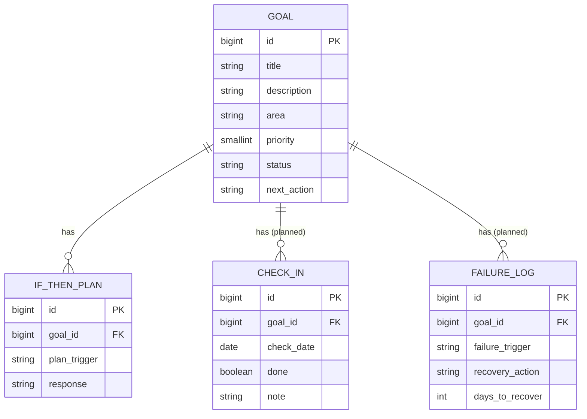
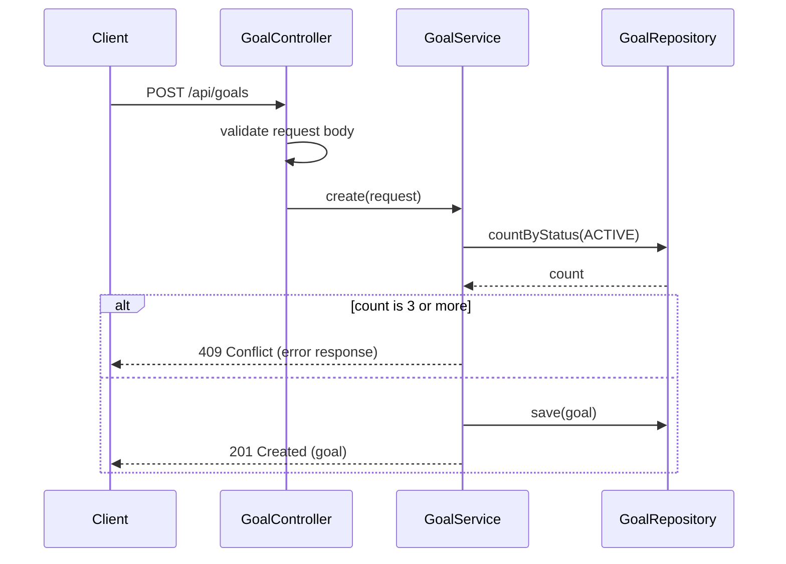
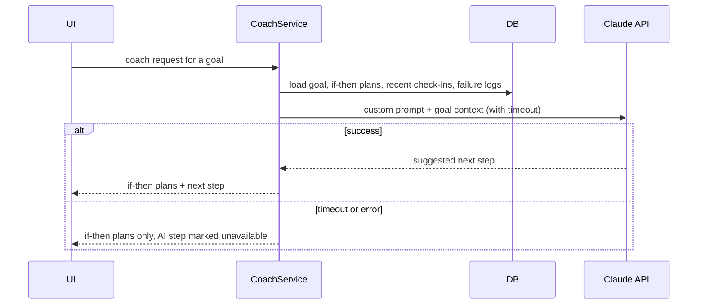

# lifeOS: High-Level Design

## 1. Overview and scope

lifeOS is a single-user goal tracker built around failure recovery. Most trackers record wins; lifeOS is built for the moment a plan breaks. The core loop:

goal, then next action, then check-in. If it fails, log it, and a pre-written if-then plan plus a Claude coach say what to do next.

**In scope (v1.0):** goals with a hard cap of 3 active, if-then plans, daily check-ins with a diary note, a failure log with recovery steps, a Claude coach, a minimal web UI, single-user login, deployment.

**Out of scope (after v1.0):** time blocking, focus mode, calendar sync, seasons, goal-connection graph, progress charts, gamification, AI buddies, finance/health integrations, multi-user support.

Implemented today: FR1 to FR3 below. The rest is designed here at module level and detailed in per-milestone LLDs before it is built.

## 2. Requirements

### Functional

| ID | Requirement |
|---|---|
| FR1 | Create, view, update and delete goals with area, priority (1 to 3), status and a next action |
| FR2 | At most 3 goals can be ACTIVE at once, across all areas |
| FR3 | Attach if-then plans (plan trigger and response) to a goal |
| FR4 | Record a daily check-in per goal (done or not done, plus a one-line note) |
| FR5 | Log failures with trigger, recovery action and time to recover; flag repeated triggers |
| FR6 | "I'm stuck": return the goal's if-then plans plus one AI-suggested next step |
| FR7 | Only the authenticated owner can read or change data |

### Non-functional

- **Consistency:** one error format across the whole API.
- **Testability:** integration tests run against a real Postgres (Testcontainers); CI must be green to merge.
- **Portability:** the full stack runs locally with Docker Compose.
- **Observability:** health via Actuator; structured logging to be added before the coach ships.
- **Resilience:** the coach is an add-on. If Claude is slow or unavailable, the rest of the app and the if-then plans still work.
- **Security:** see section 7.
- **Performance:** no formal targets (single user). The only slow path, the Claude call, is bounded by a timeout.

## 3. Architecture

**Layering:** controllers handle HTTP and validation only; services hold business rules; repositories handle persistence. DTOs are separate from entities. A global exception handler turns exceptions into the standard error response.

| Concern | Choice | Why |
|---|---|---|
| Backend | Java, Spring Boot (Web, Validation, Data JPA, Actuator) | Target stack for the developer's career move; mature ecosystem |
| Database | PostgreSQL 16 | Relational data with clear relationships; strong constraints |
| Migrations | Flyway | Versioned, repeatable schema changes |
| API docs | springdoc OpenAPI / Swagger UI | Contract generated from code |
| Tests | JUnit, MockMvc, Testcontainers | Real database in tests, no mocks for persistence |
| Local run | Docker Compose | One command for dependencies |
| CI | GitHub Actions | Build and test every PR |
| Frontend | To be decided before v1.0 | Not needed until the API is stable |

## 4. Data design

- All tables also carry `created_at` and `updated_at`, filled by JPA auditing through a shared `BaseEntity`.
- `check_ins` and `failure_logs` are proposed; their final columns are set in the v0.2 LLD.
- If-then plans are deleted with their goal (`ON DELETE CASCADE`).
- The max-3-active rule (FR2) is enforced in the service layer, not as a database constraint. That is acceptable for a single user; multi-user use would need a stronger guarantee.
- Avoid reserved SQL words in column names (`trigger` is reserved in Postgres, hence `plan_trigger` and `failure_trigger`).

## 5. Key flows

### Create a goal (max-3 rule)

### "I'm stuck" coach (proposed)

## 6. API overview

The full contract is in Swagger UI; this is the resource map.

| Resource | Base path | Operations |
|---|---|---|
| Goals | `/api/goals` | create, list, get, update, delete |
| If-then plans | `/api/goals/{goalId}/if-then-plans` | create, list, get, update, delete |
| Check-ins (planned) | `/api/goals/{goalId}/check-ins` | create, list |
| Failure logs (planned) | `/api/goals/{goalId}/failure-logs` | create, list |
| Coach (planned) | `/api/goals/{goalId}/coach` | request guidance |

**Error contract:** every error returns `timestamp`, `status`, `error`, `message`, `path`, and `fieldErrors` for validation failures. Status codes in use: 400 (validation, malformed input), 404 (missing resource, including a nested resource under the wrong parent), 409 (max-3 rule), 500 (unexpected, with no internals leaked).

## 7. External integration: Claude API

- Called server-side only; the API key never reaches the client or the repo.
- The custom coach prompt is loaded from configuration or the database, not committed to the repo.
- Every call has a timeout. On timeout, error, or a missing key, the coach returns the if-then plans without the AI step.
- Only the context needed for the request is sent (the goal, its plans, recent check-ins and failures).
- No streaming in v1: one request, one response.

## 8. Security

- **Authentication:** single-user login, required before any public deployment. The mechanism is decided before v1.0.
- **Transport:** HTTPS terminated at the hosting layer.
- **Secrets:** environment variables only; `.env` is gitignored; GitHub secret scanning and push protection are on.
- **Data sensitivity:** diary and failure entries are personal. No unauthenticated endpoint may return them, and the repo contains dummy seed data only.
- **Third-party disclosure:** using the coach sends goal and diary text to the Claude API. This is a deliberate trade-off and is stated in the README.
- **Input handling:** bean validation on every request body; error responses never expose stack traces or internals.

## 9. Deployment

- **Local:** Docker Compose runs Postgres; the backend runs from the IDE or Maven, configured through environment variables (`DB_URL`, `DB_USER`, `DB_PASSWORD`, plus the Claude key later).
- **Target:** containerised backend and Postgres, one instance each, deployed from CI on release tags. The hosting platform is decided at the deployment milestone.
- **Configuration:** Spring profiles per environment; no environment-specific values in code.

## 10. Assumptions, constraints and risks

**Assumptions:** one user, one instance, low traffic, no horizontal scaling.

**Constraints:** solo developer, part-time; milestones are timeboxed and cut before extended.

| Risk | Mitigation |
|---|---|
| Scope creep | Out-of-scope list above; each milestone has a written done-definition |
| Claude API slow, down, or costly | Timeout, fallback to if-then plans, usage only on explicit user action |
| Personal data exposure | Auth before deploy, dummy seed data, prompt kept out of the repo |
| Max-3 rule bypassed by concurrent requests | Acceptable for a single user; revisit before any multi-user work |

Architecture decisions are recorded one per file in `docs/adr/`.
