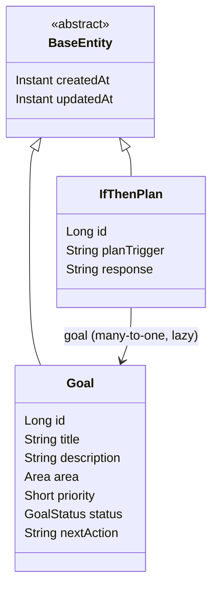
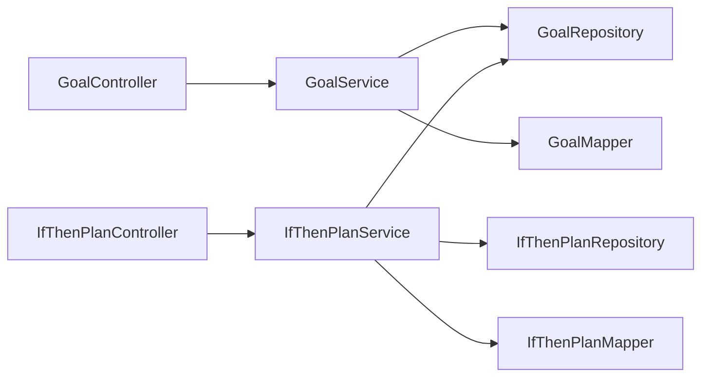
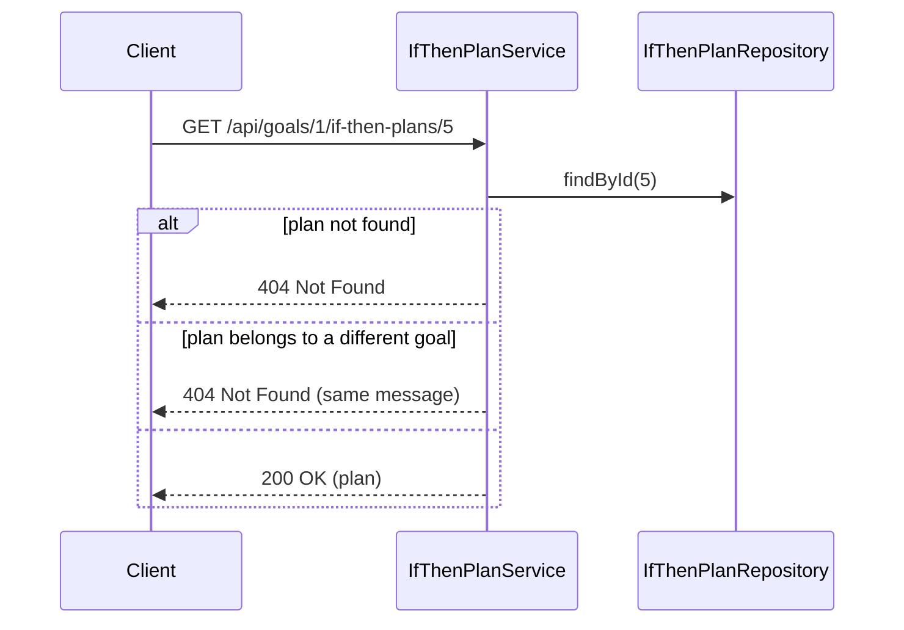

# lifeOS: Low-Level Design (v0.1, as built)

Covers the goal and if-then-plan modules and the shared infrastructure they sit on. Each later milestone adds its own section here before it is built. For system-level context see [hld.md](hld.md); for the reasoning behind key choices see [adr/](adr/).

## 1. Package layout

Base package: `org.arise`

```
org.arise
├── Main                      application entry point (JPA auditing enabled)
├── common
│   ├── BaseEntity            created/updated timestamps for all entities
│   └── exception
│       ├── NotFoundException
│       ├── ConflictException
│       ├── ErrorResponse
│       └── GlobalExceptionHandler
├── goal
│   ├── Goal, Area, GoalStatus
│   ├── GoalRepository, GoalService, GoalController, GoalMapper
│   └── dto: CreateGoalRequest, UpdateGoalRequest, GoalResponse
└── ifthenplan
    ├── IfThenPlan
    ├── IfThenPlanRepository, IfThenPlanService, IfThenPlanController, IfThenPlanMapper
    └── dto: CreateIfThenPlanRequest, UpdateIfThenPlanRequest, IfThenPlanResponse
```

Test sources mirror the main layout and share one `IntegrationTest` base class.

## 2. Class design



- `Area`: CAREER, HEALTH, FINANCE, PERSONAL. `GoalStatus`: ACTIVE, PAUSED, COMPLETED, ARCHIVED. Both are stored as strings.
- `priority` is a `Short` end to end (entity, DTOs, tests): 1 is highest, 3 is lowest.
- `BaseEntity` fills `createdAt` and `updatedAt` through Spring Data JPA auditing, which must be enabled on the application or a configuration class.

### Dependencies between layers



Controllers depend only on their service. Services own business rules and throw domain exceptions. Mappers are static utility classes that convert between DTOs and entities; entities are never returned from a controller.

## 3. Database schema

Managed by Flyway (`src/main/resources/db/migration`). An applied migration is never edited; changes go in a new version.

| Migration | Contents |
|---|---|
| `V1__create_goals.sql` | `goals`: id, title (120), description (text), area (20), priority (smallint, check 1 to 3), status (20, default ACTIVE), next_action (255), created_at, updated_at |
| `V2__create_if_then_plans.sql` | `if_then_plans`: id, goal_id (FK to goals, `ON DELETE CASCADE`), plan_trigger (255), response (255), created_at, updated_at; index on goal_id |

Hibernate runs with `ddl-auto=validate`, so a mismatch between an entity and its table fails at startup.

## 4. API endpoints

### Goals: `/api/goals`

| Method | Path | Success | Errors |
|---|---|---|---|
| POST | `/api/goals` | 201 + goal | 400 validation or malformed body, 409 more than 3 active goals |
| GET | `/api/goals` | 200 + list | none |
| GET | `/api/goals/{id}` | 200 + goal | 400 non-numeric id, 404 |
| PUT | `/api/goals/{id}` | 200 + goal | 400, 404 |
| DELETE | `/api/goals/{id}` | 204 | 400, 404 |

### If-then plans: `/api/goals/{goalId}/if-then-plans`

| Method | Path suffix | Success | Errors |
|---|---|---|---|
| POST | (none) | 201 + plan | 400, 404 goal not found |
| GET | (none) | 200 + list | 404 goal not found |
| GET | `/{planId}` | 200 + plan | 404 plan not found, or plan belongs to another goal |
| PUT | `/{planId}` | 200 + plan | 400, 404 |
| DELETE | `/{planId}` | 204 | 404 |

## 5. Validation rules

| DTO | Field rules |
|---|---|
| `CreateGoalRequest` | title: not blank, max 120. description: max 2000. area: required. priority: required, 1 to 3. nextAction: max 255 |
| `UpdateGoalRequest` | Same as create, without `area` (area is fixed after creation) |
| `CreateIfThenPlanRequest`, `UpdateIfThenPlanRequest` | planTrigger: not blank, max 255. response: not blank, max 255 |

## 6. Business logic

**GoalService**
- `create`: counts goals with status ACTIVE. If the count is already at the cap (`MAX_ACTIVE_GOALS = 3`) it throws `ConflictException`; otherwise it saves the goal as ACTIVE.
- `get`, `update`, `delete`: load the goal or throw `NotFoundException`.
- `update` cannot change status, because `UpdateGoalRequest` has no status field. Any future status-change operation must enforce the cap when a goal becomes ACTIVE.

**IfThenPlanService**
- `create` and `list` require the parent goal to exist.
- `get`, `update`, `delete` load the plan and verify it belongs to the goal in the URL. A plan under the wrong goal returns the same 404 as a missing plan, so plan IDs cannot be probed across goals.



## 7. Error handling

`GlobalExceptionHandler` (`@RestControllerAdvice`) converts every exception into one `ErrorResponse`: `timestamp`, `status`, `error`, `message`, `path`, and `fieldErrors` (validation only).

| Exception | Status | Message |
|---|---|---|
| `MethodArgumentNotValidException` | 400 | "Validation failed" + `fieldErrors` |
| `MethodArgumentTypeMismatchException` | 400 | "Invalid value for parameter '&lt;name&gt;'" |
| `HttpMessageNotReadableException` | 400 | "Malformed request body" |
| `NotFoundException` | 404 | Resource-specific message |
| `ConflictException` | 409 | Rule-specific message |
| `Exception` (fallback) | 500 | "Something went wrong" (details never exposed) |

The three 400 cases occur at different stages: path/query binding, JSON parsing, and bean validation. Each raises a different exception, so each needs its own handler.

## 8. Testing

- **Base class:** `IntegrationTest` starts a Testcontainers Postgres 16, boots the full application on a random port, autowires `MockMvc`, and pins the JVM time zone to UTC.
- **Naming and execution:** `*IT` classes run through Failsafe with `mvn verify`; `*Test` classes are unit tests run with `mvn test`. CI runs `mvn verify`.
- **Coverage today:** repository persistence (`GoalRepositoryIT`, `IfThenPlanRepositoryIT`); goal CRUD flow, blank-title validation, 404 body shape, non-numeric id, malformed JSON, and the 409 cap (`GoalControllerIT`); plan CRUD flow, missing parent goal, and cross-goal access (`IfThenPlanControllerIT`).

## 9. Known limitations

- The max-3 rule is checked in the service, not enforced by the database.
- `GET /api/goals` returns all goals with no pagination or filtering.
- Goal status cannot be changed yet (pause, complete, archive).
- Entities are mapped by hand; a mapping library can be introduced if the boilerplate grows.
